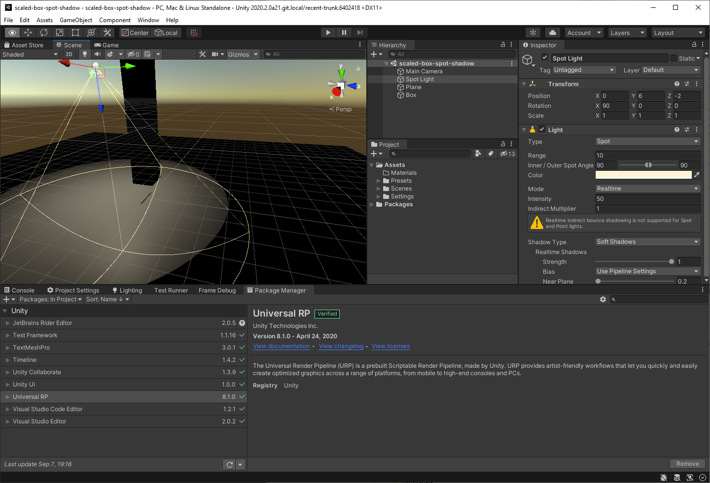
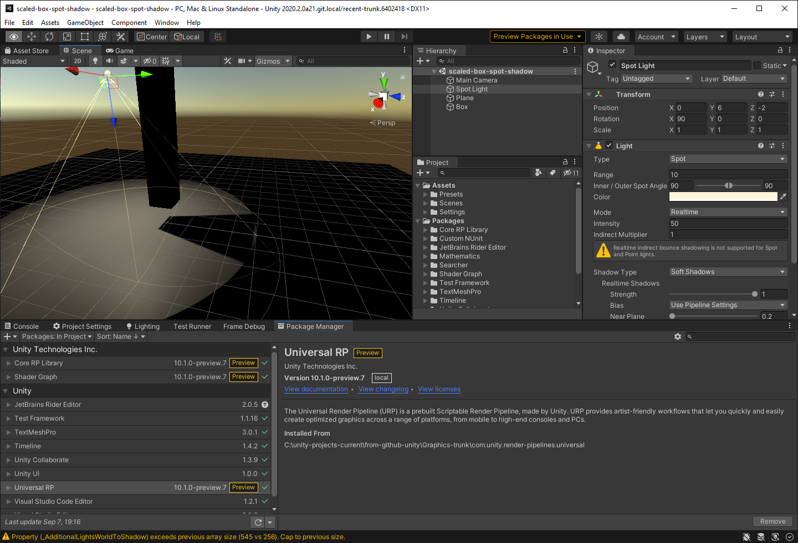

# scaled-box-spot-shadow
Test project illustrating a Unity Universal RP spot shadow issue

----

With URP Package 8.1.0 scene looks like this:

(It is the same just before the fix, i.e when modifying Packages/manifest.json to use URP package from revision https://github.com/Unity-Technologies/Graphics/commit/f3eb40d )

----

When modifying Packages/manifest.json to use URP package from revision https://github.com/Unity-Technologies/Graphics/commit/e1b798b (just after the fix), the scene looks like this (i.e correct depth values are stored in the shadow map):

